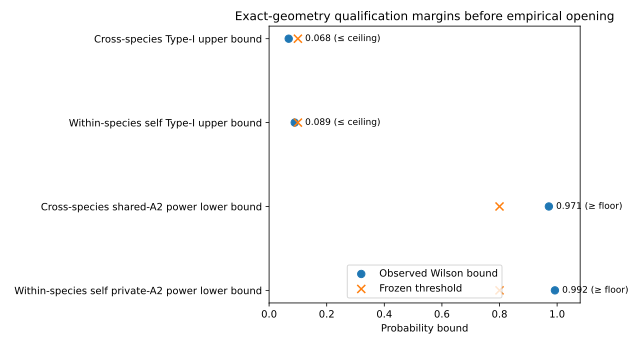
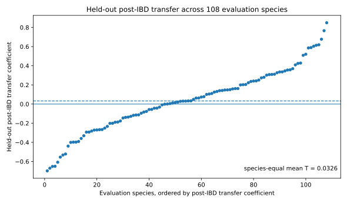

# Within-species genetic structure is detectable but not detectably transferable across unseen lineages

**Empirical manuscript v0.2 — frozen Phase-4 Branch B result integrated**

Author list: TBD

Target journal: deferred until scope and presentation are finalized. Journal choice cannot change the frozen estimand, qualification thresholds, opening sequence, or interpretation contract.

---

## Abstract

Geographic structure in within-species genetic variation reflects both repeatable properties of place and the particular histories of evolutionary lineages. Comparative phylogeography has long sought spatial patterns shared across codistributed species, but retrospective concordance does not show whether geographic information learned from one set of species predicts differentiation in species excluded from model fitting. We define shared geographic structure operationally as **out-of-species transferability**. For each species, exact sampling localities are connected by a density-scaled graph, genetic differentiation is summarized on graph edges, and a leave-two-localities-out nuisance fit removes ordinary isolation by distance (IBD) before a spatial turnover field is learned from training species. A fresh phylogatR COI/COX1 analysis was prospectively gated so that geometry, character admissibility and exact-geometry synthetic qualification were fixed before nucleotide identities were opened. Phase 1 froze 250 species; 211 survived the character-support gate and inherited a 103-training/108-evaluation split. The exact survivor geometry passed the predeclared cross-species calibration (maximum private-null Wilson 95% upper bound 0.0681; shared-A2 Wilson 95% lower bound 0.9714) and the separate within-species self-detectability qualification. In the single authorized empirical opening, post-IBD transfer to unseen species was not detected (T = 0.0326, profiled-private p = 0.7393), whereas the separately calibrated within-species self statistic exceeded its frozen null reference (S = -0.2261, upper-tail p = 0.0090). The pre-IBD total-transfer score was 0.0155 and remained descriptive only. Thus, within this COI/COX1 domain, spatial genetic structure is detectable within species but is not detectably reusable across unseen lineages under the tested geographic field, consistent with lineage-conditioned spatial structure rather than a universally transferable map of differentiation.

---

## Introduction

The geographic distribution of genetic variation within species contains information about dispersal, demographic history, environmental change, and the landscape features through which lineages have moved. Rivers, mountain systems, climatic transition zones, refugia, coastlines, and archipelagos can leave repeated signatures across multiple species, and comparative phylogeography has used such concordance to infer shared aspects of biotic history (Hickerson et al. 2010; Edwards et al. 2022). This emphasis on geography is one of the field's defining strengths: rather than treating place as incidental metadata, comparative phylogeography asks how evolutionary histories are embedded in landscapes.

Yet a repeated pattern observed retrospectively across species can mix several sources of information. Species may share barriers, but they may also share broad range geometry, sampling design, dispersal limitation, phylogenetic history, or simply the tendency for genetic differentiation to increase with geographic distance. Conversely, species exposed to the same landscape may respond differently because of differences in dispersal, demography, habitat association, generation time, or historical range dynamics. The empirical literature therefore contains both striking cases of concordance and extensive heterogeneity among lineages (Edwards et al. 2022). This makes the phrase “shared phylogeographic structure” biologically intuitive but statistically underdetermined unless sharedness is given an operational criterion.

Prediction provides such a criterion. If some component of spatial genetic differentiation belongs to geography rather than only to the lineages used to discover it, information learned from one set of species should improve predictions for species that were entirely absent from model fitting. This criterion is stronger than finding overlapping breaks after examining all species jointly. It asks whether the geography itself carries reusable information. Recent work has begun to make comparative phylogeography more predictive, including machine-learning approaches that relate species traits and range characteristics to whether phylogeographic breaks are detected. Decker, Provost and Carstens (2025), for example, showed that range and morphological characteristics can predict break occurrence in volant vertebrates. That problem is complementary to ours: instead of predicting whether a species has a break from species-level covariates, we ask whether the **location of within-species differentiation** transfers from training lineages to unseen lineages.

A second difficulty is isolation by distance (IBD). Genetic differentiation often increases with geographic separation even in the absence of a discrete place-specific transition. The principle dates to Wright (1943) and remains central to spatial population genetics (Rousset 1997). A transfer method that merely learned that distant localities tend to be genetically different could appear successful across many species without identifying any reusable geography. We therefore distinguish two estimands. **Total genetic transfer** asks whether raw within-species genetic-distance rank transfers across species. The primary estimand, **place beyond IBD**, asks whether spatial differentiation remaining after a prospectively fixed within-species IBD expectation transfers to unseen species. Total transfer is a descriptive comparator under the current qualification. A positive total score without significant residual transfer does not establish a place-specific field or identify generic distance as its cause.

Pairwise genetic data introduce an additional dependence problem. Two graph edges that share a locality also share biological information. Randomly withholding individual edges therefore does not create a clean nuisance fit for IBD. We address this by leave-two-localities-out residualization: for target edge `(i,j)`, the IBD fit excludes every other edge incident to either `i` or `j`. Only endpoint-disjoint edges may contribute to the held-out expectation. After this biological nuisance layer is removed, a species-disjoint spatial field is learned from training species and evaluated on species held entirely outside training.

Finally, not every empirical sampling geometry can support this question. A transfer statistic may be formally computable while having poor Type-I behavior under strong private spatial structure or insufficient power to detect a shared field. We therefore make qualification part of the biological analysis rather than a generic method validation performed elsewhere. Before empirical genetic outcomes are interpreted, the **exact empirical geometry** must pass prospectively frozen simulations that preserve within-species endpoint dependence and test both false transfer under private spatial structure and recovery of a shared residual field. Failure yields `NOT_EVALUABLE`, not evidence that shared geography is absent.

Here we develop and execute this predictive test of phylogeographic transferability. We first use a public bird-and-bat geometry as a development system, without opening its genetic outcomes, to establish the graph, IBD, inferential, and self-detectability machinery. The development geometry demonstrates why geometry-specific calibration is necessary: within-species self-detectability passes, but cross-species Type-I control narrowly fails its frozen gate. We then apply the frozen workflow to a fresh authenticated phylogatR archive, separating geometry, character admissibility, synthetic qualification, and nucleotide-identity opening into sequential phases so that the biological outcome cannot influence the design. The fresh geometry passed its predeclared qualification gates, allowing one empirical opening. That test did not detect transfer of post-IBD differentiation to unseen species, while the independently qualified within-species self test was significant relative to its calibrated null, resolving the predeclared interpretation as lineage-conditioned spatial structure within the tested domain.

---

## Materials and Methods

### 1. Overview and inferential target

For each species `s`, let sampled localities define nodes in a species-specific spatial graph and let `G_{s,ij}` denote genetic differentiation between connected localities `i` and `j`. The goal is not to pool species into one genetic surface. Instead, each species contributes a within-species turnover pattern, and training species are used to learn a geographic field that is evaluated on species withheld entirely from training.

The primary inferential estimand and secondary descriptive estimand remain separate. The Phase-4 runner produces the primary transfer result, the within-species self diagnostic, and total genetic transfer as a descriptive summary.

**Total genetic transfer** uses within-species rank-standardized genetic differentiation on graph edges. It uses the same graphs, split, species weights, kernel and training-only edge-length-rank control as the primary analysis, but omits biological IBD residualization. Under the frozen Phase-4 rule it is descriptive only unless separately qualified, and cannot override or rescue the primary decision.

**Place beyond IBD**, the primary estimand, first removes an endpoint-safe within-species rank-linear IBD expectation and then rank-standardizes the residual edge turnover. Only this residual estimand can support the claim that geographic location carries transferable information beyond generic distance dependence.

The unit of replication for transfer is the species. Edges contribute to the within-species spatial pattern but are not treated as independent species-level replicates.

### 2. Separation of development and confirmatory data

#### Development geometry

Method development used response-blind sampling geometry derived from the public repository accompanying Decker et al. (2025), frozen at the predeclared source commit. Only species/locus identifiers, accession/header identifiers, coordinates, exact coordinate duplication, record counts, graph geometry, edge lengths, and response-blind support diagnostics were permitted during development.

Pairwise sequence distances, nucleotide-diversity summaries, Monmonier outputs, break presence/absence, and other genetic outcomes were excluded from method selection. Because the upstream Decker data processing was designed for a different phylogeographic analysis, these data are development-only and cannot serve as the confirmatory empirical test.

A response-blind census yielded a frozen one-panel-per-species development set of 221 systems (149 Aves and 72 Chiroptera), divided deterministically into training and evaluation species. The exact development geometry and all failed qualification attempts remain preserved in the repository audit trail.

#### Fresh confirmatory source

The confirmatory source is a genuinely fresh phylogatR download acquired after the full analysis contract was frozen. phylogatR aggregates sequence data from GenBank with georeferenced occurrence information and distributes aligned FASTA files together with occurrence coordinates and provenance information (Pelletier et al. 2022).

The confirmatory taxonomic domain is Animalia excluding Aves, excluding Chiroptera, and excluding the exact frozen 221-species Decker development set. The marker family is COI/COX1 under a frozen alias-normalization rule. If multiple eligible panels exist for one species, the panel is chosen using geometry only: maximum number of exact unique localities, then sequence count, then deterministic lexical tie-breaking. Genetic character identities are unavailable to this choice.

A species requires at least 12 exact unique localities and at least five endpoint-disjoint edges available for the IBD nuisance fit. If more than 250 species are eligible, the first 250 under the frozen source-digest/species hash are retained. If 150–250 are eligible, all are retained. Fewer than 150 species yields `NOT_EVALUABLE_PHASE1_PANEL_TOO_SMALL` and the confirmatory analysis stops before character masks or nucleotide identities are opened.

### 3. Locality definition and density-scaled spatial graphs

The biological spatial node is an exact unique latitude-longitude pair, not an individual sequence. Multiple sequences with identical coordinates are associated with the same locality and therefore do not inflate the number of spatial nodes. Near but nonidentical coordinates are not merged by a post hoc distance threshold.

For a species with `n_s` exact unique localities, the within-species graph uses the frozen density-scaled neighbor rule

`k_s = min(n_s - 1, max(2, floor(0.15 * n_s + 0.5)))`.

This rule was inherited from the qualified core TTF architecture, where fixed small neighbor counts became progressively more local as sampling density increased, whereas a constant neighbor fraction preserved edge-scale observability. The graph rule depends only on locality geometry and cannot respond to genetic outcomes.

Each undirected edge stores its endpoint localities, geographic length, and the number of other graph edges that share neither endpoint. Graph topology is frozen before genetic identity is opened.

### 4. Phased opening of the fresh data

The confirmatory archive is processed under four sequential phases.

#### Phase 1: response-blind geometry

The intake reads provenance files, species/locus identities, accession/header information, and coordinates. For FASTA files, only header structure is used; nucleotide sequence lines are not interpreted for the analysis. The complete archive is hashed, the selected panel is frozen, and the exact graph geometry and deterministic train/evaluation split are written to an immutable receipt.

The required pass state is `FROZEN_RESPONSE_BLIND_PHASE1_GEOMETRY` with at least 150 species. No Phase-2 operation is automatically triggered.

#### Phase 2: character-mask admissibility

Only whether each aligned character is canonical (`A`, `C`, `G`, or `T`) versus noncanonical is revealed. Actual nucleotide identity remains masked. These boolean validity masks are used to determine whether every frozen graph edge has at least one cross-locality sequence pair with sufficient comparable sites.

A sequence pair is valid only when the number of jointly canonical alignment columns is at least 50% of the frozen alignment length. If any frozen edge lacks a valid cross-locality pair, the affected species is marked empirical-outcome `NOT_EVALUABLE`; its graph is not repaired. No marker switching, edge dropping, graph rewiring, or train/evaluation resplitting is permitted. At least 150 species must survive.

#### Phase 3: exact-geometry synthetic qualification

Before nucleotide identities are opened, the exact Phase-2 survivor geometry is subjected to a full dataset-specific synthetic qualification. Synthetic genetic worlds are generated from latent locality states so that pairwise responses sharing a locality are statistically dependent rather than independent edge draws.

The qualification includes private residual structure, shared residual structure, IBD variation, and the inherited profiled-private inference. The frozen design uses eight private-reference configurations with 1,999 worlds per configuration and five mandatory observed cells with 500 worlds per cell. The private-null family must satisfy a Wilson 95% upper rejection bound of at most `0.10`, and the shared moderate-signal A2 cell must satisfy a Wilson 95% lower power bound of at least `0.80`.

Any failure produces `NOT_EVALUABLE`; nucleotide identity remains closed and no empirical genetic transfer statistic is computed.

A separate within-species self-detectability qualification is run on the exact fresh evaluation geometry. It uses endpoint-safe prediction within each species and a frozen null/private-positive synthetic design. This gate is not required to interpret a significant cross-species transfer result. It is required to interpret a later qualified non-significant cross-species result as evidence consistent with lineage-conditioned spatial structure.

#### Phase 4: nucleotide identity and empirical response

Phase 4 is authorized only after complete Phase-3 PASS on the exact Phase-2 survivor geometry. Nucleotide identities are then unmasked under the already frozen response rule. The analysis does not use Phase-4 outcomes to alter species selection, graph topology, IBD rules, bandwidth, null construction, alpha, or qualification thresholds.

### 5. Genetic distance on frozen edges

For every valid cross-locality sequence pair, genetic distance is the uncorrected p-distance over jointly canonical alignment columns. The sequence normalization is uppercase and only `A`, `C`, `G`, and `T` contribute to comparable columns. The locality-pair distance `G_{s,ij}` is the arithmetic mean across all valid sequence pairs connecting locality `i` to locality `j`.

The frozen edge list is retained exactly. If an edge cannot be evaluated under the character-admissibility contract, the response is not rescued by removing or replacing that edge.

### 6. Endpoint-safe isolation-by-distance residualization

IBD is treated as a biological nuisance layer rather than a geometry correction. For target edge `e=(i,j)`, all other edges incident to `i` or `j` are excluded from the nuisance fit. Only endpoint-disjoint within-species edges are allowed to estimate the relation between geographic and genetic separation for that target.

Both geographic and genetic distances are represented by training-set order. An ordinary least-squares regression of genetic rank fraction on geographic rank fraction is fitted using the endpoint-disjoint edges, and the expected and observed order fractions are evaluated for the held-out edge. The fitted slope is not constrained to be nonnegative; this is rank-linear regression, not a shape-constrained monotone regression. The residual is the observed minus expected order fraction. Repeating this procedure for every graph edge yields an out-of-pair residual vector that is subsequently rank-standardized within species.

The procedure is invariant to strictly increasing transformations of geographic or genetic distance and removes a noiseless strictly monotone IBD relationship exactly. These properties do not establish removal of every stochastic or spatially heterogeneous IBD process. The residual estimand and its Type-I guarantee remain conditional on the declared nuisance rule and qualified synthetic family.

### 7. Learning the transferable turnover field

After response construction, training and evaluation species remain strictly disjoint. The spatial field is learned from graph edges of training species only using the inherited exact TTF kernel architecture and frozen 500-km bandwidth. Each training species contributes equally to the field rather than in proportion to its number of edges.

The inherited geometry control removes training-set association with edge-length rank before evaluation. No held-out response is used to tune the field, bandwidth, geometry correction, or private-strength profile.

For each evaluation edge, the trained field produces a predicted turnover value using geographic position alone. Within each evaluation species, predictive skill is summarized as the Spearman correlation between predicted and observed edge turnover. The primary aggregate statistic is

`T = mean_s Spearman(predicted_s, observed_s)`

over every frozen evaluation species. The empirical adapter rejects a non-finite score for any evaluation species rather than silently averaging over the remaining species.

### 8. Profiled-private inference

The null hypothesis is not that traits or genetic responses are exchangeable over localities. Strong spatial structure may exist within every species while remaining private to that lineage. A naive permutation null could therefore destroy the very nuisance structure that must be preserved.

Inference instead uses a profiled-private reference family generated on the frozen empirical geometry. Training-only coherence determines the private-structure profile. For each of eight configurations, the first 999 reference worlds supply the median and median-absolute-deviation scale used to rank compatibility with the observed training coherence. The two most compatible configurations are selected without using the held-out transfer statistic. The remaining 1,000 worlds per configuration supply independent upper-tail Monte Carlo p-values; the primary p-value is the maximum of the two component p-values. The frozen alpha level is `0.05`.

A significant primary result supports transferability beyond private lineage-specific structure under the declared model family. A non-significant result is interpreted only together with qualification and self-detectability evidence.

### 9. Development qualification

The frozen Decker development geometry was used to test the genetic interface before any Decker genetic outcomes were opened. The final cross-species Gate-D qualification was `NOT_EVALUABLE`. The binding private A3 cell had Wilson 95% upper rejection bound `0.10033475332223055`, narrowly exceeding the frozen ceiling `0.10`. The shared-A2 positive-control gate passed, with Wilson 95% lower power bound `0.8355052092686175`, exceeding the frozen floor `0.80`.

A separate within-species self-detectability qualification on the same development geometry passed. Its null Wilson 95% upper bound was `0.053771365501634506`, and its private-A2 Wilson 95% lower power bound was `0.9923756595384479`.

Because the cross-species Type-I gate failed, Decker nucleotide identities, pairwise genetic distances, break labels, and empirical transfer statistics remain unopened and are not used as an empirical result in this study.

### 10. Frozen interpretation rules

A fresh empirical result is interpreted according to the following predeclared branches.

**Transferable place component.** Fresh cross-species qualification passes and the primary place-beyond-IBD empirical test has `p <= 0.05`.

**Lineage-conditioned spatial structure.** Cross-species qualification passes, the primary test has `p > 0.05`, the fresh self-detectability qualification passes, and the empirical within-species self test is significant under its frozen rule.

**Not evaluable for lineage conditioning.** Cross-species qualification passes and the primary test is non-significant, but qualified empirical self-detectability support is absent.

**Design not evaluable.** Any required Phase-1, Phase-2, Phase-3 Type-I, or Phase-3 power gate fails.

No failure branch is reworded as evidence that transferable geography is biologically absent.

### 11. Reproducible reporting

The completed empirical result is linked to its Phase-4 authorization by SHA-256. A downstream reporting tool checks consistency with the frozen qualification, self qualification, rules, geometry fingerprint and species split before generating the Results passage and a complete evaluation-species table. Aggregate means, p-value components, significance flags and the interpretation branch must agree. Input interpretation prose is not copied. This reporting check does not rerun the statistical analysis or independently authenticate upstream source provenance.

The total-transfer descriptor is reported separately from primary inference. Constant response or prediction vectors retain the inherited TTF zero-score convention. Non-finite total scores remain attached to their species and make the complete descriptive aggregate unavailable, rather than changing the evaluation population. Differences between total and residual rank correlations are not fractions of genetic variation explained by IBD.

A closed opening-state or failed Phase-1/2/3 receipt produces a status note only, with no empirical Results paragraph or species scores. This preserves the distinction between completed software, synthetic qualification and empirical evidence.

---

## Results

### Development geometry reveals a distinction between within-lineage detectability and cross-lineage qualification

The endpoint-safe genetic interface was first evaluated on the frozen Decker bird-and-bat sampling geometry without opening its empirical genetic outcomes. The cross-species Gate-D did not meet its prospectively frozen Type-I requirement. The binding private A3 rejection interval had an upper Wilson bound of `0.10033475332223055`, just above the `0.10` ceiling, whereas the shared-A2 power lower bound was `0.8355052092686175` and therefore exceeded the `0.80` power floor. Under the frozen decision rule the development design was consequently `NOT_EVALUABLE` for empirical cross-species transfer.

The separate within-species self-detectability gate passed on the same geometry. Its null upper bound (`0.053771365501634506`) was below the frozen Type-I ceiling and its private-A2 lower power bound (`0.9923756595384479`) was above the frozen power floor. Thus, on this development geometry, the declared synthetic within-species structure is detectable while cross-species calibration fails. This does not establish that the unopened Decker genetic responses contain detectable structure. This distinction motivates qualification on the exact confirmatory geometry rather than assuming that a method validated elsewhere is automatically deployable on a new multispecies dataset.

### Fresh confirmatory sampling geometry and character admissibility

The authenticated phylogatR archive reproduced the frozen source identity exactly (274,988,692 bytes; SHA-256 `5a0fd9ac25893c749d14186fbcce4a46b99163c9d810b36e40eebce7bece61a5`). After the frozen Animalia, taxonomic-exclusion, marker and geometry rules, 14,862 species were eligible before the deterministic cap and 250 species were retained. These 250 species contained a median of 20 exact localities (IQR 15–33; range 12–295) and a median of 39.5 frozen graph edges (IQR 20–105.75). The panel was strongly arthropod dominated (236/250 Arthropoda; 217 Insecta), reflecting the available phylogatR COI/COX1 source domain rather than a balanced taxonomic design.

Phase 2 opened only canonical-character validity masks. Thirty-nine species failed because one or more already-frozen graph edges lacked a valid cross-locality sequence pair under the predeclared comparable-site rule. No failed edge was dropped or rewired. The remaining 211 species retained the inherited Phase-1 split without resplitting: 103 training and 108 evaluation species. Among survivors, the median number of exact localities was 19 (IQR 15–30.5), the median number of frozen edges was 38 (IQR 20–101), and the median minimum endpoint-disjoint nuisance-fit support was 26 edges (IQR 13–82). The survivor panel remained strongly arthropod dominated (200/211 Arthropoda; 183 Insecta).

### Exact-geometry synthetic qualification

The exact 211-species Phase-2 survivor geometry passed the prospectively frozen cross-species Gate-D. Across the four mandatory private-structure cells, rejection rates were 0.046, 0.030, 0.034 and 0.040 at residual amplitudes 0.5, 1, 2 and 3, respectively. The largest Wilson 95% upper bound was 0.06808, below the predeclared 0.10 Type-I ceiling. The shared-A2 positive-control cell rejected in 493/500 worlds (0.986), with Wilson 95% lower bound 0.97139, above the 0.80 power floor. Phase 4 was therefore eligible to open nucleotide identity on this exact geometry.

The separate within-species self-detectability qualification also passed. The null cell rejected in 32/500 worlds (0.064; Wilson upper 0.08895), while the private-A2 cell rejected in 500/500 worlds (Wilson lower 0.99238). This self test is an upper-tail statistic calibrated against its own structural-null distribution; its empirical numerical sign is therefore not interpreted against zero.

*Figure 1. Exact-geometry qualification margins before the empirical opening. Circles show the frozen Wilson bounds and × symbols show the predeclared thresholds. Type-I bounds pass by remaining at or below 0.10; power bounds pass by remaining at or above 0.80. The figure only visualizes already-frozen qualification receipts.*

### Empirical transfer to unseen species

The single authorized Phase-4 opening did not detect cross-species transfer of post-IBD spatial differentiation. The species-equal `place_beyond_ibd` statistic was `T = 0.0325655`; the frozen profiled-private p-value was `0.739261` (`A3 = 0.668332`, `A5 = 0.739261`). Under the predeclared decision rule this is not evidence for a transferable place component.

The independently qualified within-species self diagnostic was significant relative to its frozen null (`S = -0.226098`, upper-tail `p = 0.008991`). Because this statistic is calibrated against a null distribution that is itself shifted below zero by the endpoint-safe self-field construction, significance is interpreted relative to that reference distribution rather than as a positive raw Spearman correlation. Together with the non-significant cross-species test, this resolves the frozen Branch-B decision: `LINEAGE_CONDITIONED_SPATIAL_STRUCTURE_WITHIN_TESTED_DOMAIN`.

The secondary pre-IBD total genetic-transfer score was `0.0155016`. It has no inferential qualification, p-value or significance label and cannot rescue the primary result. A receipt-only exporter independently checked the complete hash-linked result chain and retained all 108 evaluation species in the generated reporting bundle.

*Figure 2. Held-out post-IBD transfer coefficients for all 108 evaluation species, ordered by coefficient only for display. The dashed horizontal line is the frozen species-equal aggregate `T = 0.0325655`, and the zero line is a visual reference. Individual points are descriptive species-level components of the aggregate; no species-level significance tests are performed, and the display ordering has no inferential role.*

---

## Discussion

### A predictive definition of shared phylogeographic structure

The central contribution of this study is to make “shared geography” a predictive rather than purely retrospective concept. Comparative phylogeography has traditionally gained power from comparing codistributed species and identifying repeated geographic structure across lineages. That logic remains biologically valuable, but repeated patterns can be identified after all species are visible. Our criterion is deliberately stricter: a spatial component is transferable only to the extent that a field learned without an evaluation species predicts the spatial pattern of differentiation within that species.

This change in criterion also changes what counts as replication. Thousands of graph edges do not become thousands of independent tests of shared history. Species are the held-out systems. The field can exploit multiple edges to represent a species' within-range structure, but the transfer statistic asks whether information generalizes across evolutionary lineages.

### Why isolation by distance must be separated from place

A cross-species geographic predictor could succeed for a biologically uninteresting reason if all species show similar monotone increases of genetic differentiation with distance. By defining the primary estimand after species-specific endpoint-safe IBD removal, we ask whether particular parts of geographic space carry information beyond the generic effect of separation. Total genetic transfer remains useful diagnostically, but it cannot by itself support a claim about a transferable place-specific field.

The endpoint-safe construction is especially important for pairwise responses. Sharing a locality is a direct path of biological dependence, so ordinary edge-wise cross-validation would allow nuisance estimation to borrow information from the held-out comparison. Excluding all edges incident to either target endpoint makes the IBD layer conservative with respect to that dependence.

### Qualification is part of the biological conclusion

The development analysis demonstrates why a calculable statistic is not automatically an interpretable statistic. On the bird-and-bat geometry, within-species self-detectability was strong under the frozen synthetic gate, yet cross-species Type-I control missed its threshold narrowly. Treating that design as a negative empirical test would therefore confuse inferential failure with biological absence.

The confirmatory workflow formalizes abstention. Geometry and character support are checked before nucleotide identity is visible; the exact survivor geometry is then challenged with strong private spatial structure and a shared positive control. Only if both false-transfer control and power are adequate is the empirical response opened. This ordering prevents a weak or inconvenient observed result from motivating a new graph, threshold, species subset, or null model.

### Empirical interpretation: spatial structure is not a transferable map across lineages

The confirmatory result resolves the predeclared Branch-B interpretation. The key asymmetry is not “structure versus no structure.” The exact geometry could detect the target synthetic signals, and the empirical within-species self statistic was extreme in the calibrated upper tail, yet the geographic field learned from 103 training species did not predict post-IBD differentiation across the 108 unseen evaluation species. In this domain, spatial genetic structure therefore appears to be conditioned by lineage rather than captured by one reusable place field.

This distinction is stronger than simply reporting a non-significant cross-species statistic. The self qualification and empirical self test were frozen specifically to distinguish a failure of cross-lineage transfer from a design that could not detect within-species spatial structure at all. At the same time, the result is not an equivalence test for zero transfer. The confidence claim is bounded to the frozen COI/COX1 marker family, taxa represented in phylogatR, graph scale, 500-km field and profiled-private null family.

The result also clarifies the role of ordinary distance. The descriptive pre-IBD total score was small (`0.0155`) and was never inferentially qualified. We therefore do not infer that generic IBD explains the absence of residual transfer, nor do we interpret the difference between the total and residual rank correlations as a fraction of variation explained. The supported statement is narrower: after the predeclared endpoint-safe IBD adjustment, there was no detectable cross-species reusable place component under the qualified test.

Biologically, several processes could generate such lineage conditioning: differences in dispersal, demographic history, habitat association, barrier permeability, range shifts, or idiosyncratic responses to the same landscape. None is identified by the current analysis. Distinguishing among them requires a new, prospectively specified predictor-competition or mechanistic study rather than post-result retuning of the present field.

### Scope and limitations

First, the confirmatory analysis uses the COI/COX1 marker family. Mitochondrial sequence variation provides broad taxonomic coverage and is particularly compatible with phylogatR-scale reuse, but it represents one genealogical history and should not be equated with whole-genome population structure. A transferable COI field would be evidence for reusable spatial information in this marker domain, not proof that the same fraction of structure transfers at nuclear loci.

Second, the tested field is scale dependent. The graph density, 500-km kernel bandwidth, geographic support of the included taxa, and phylogatR sampling process define the spatial domain over which transfer is evaluated. A non-transfer result at this scale does not imply non-transfer at finer or broader scales.

Third, predictive transfer is not causal attribution. A species-disjoint split does not guarantee phylogenetic independence or remove shared demographic history. Related held-out species or lineages exposed to the same historical event can share predictive geography. Positive transfer therefore cannot partition place effects from shared lineage history; likewise, a qualified non-significant result with self support is not an equivalence test establishing zero transfer. Even a strong held-out result would show that place carries reusable information, but multiple correlated geographic mechanisms could generate that information. Separating topography, climate history, habitat transitions, barriers, and other drivers would require a subsequent predictor competition or independent mechanistic design.

Fourth, public sequence and occurrence databases are opportunistic samples. The phased geometry and character-admissibility gates reduce some consequences of uneven sampling, and species are weighted equally in the transfer statistic, but database representation still determines the lineages and geographic regions available for inference.

Finally, the deliberate abstention rules trade apparent decisiveness for calibrated interpretation. This is a feature rather than a defect of the design. A multispecies analysis should not claim biological absence when its own sampling geometry lacks the resolution to detect the target pattern reliably.

### Conclusion

A spatial pattern of within-species genetic differentiation can be detectable without constituting a geographic rule that transfers across evolutionary lineages. In the exact fresh phylogatR COI/COX1 domain tested here, the qualified `place_beyond_ibd` analysis found no detectable out-of-species transfer, while the independently calibrated within-species self test was significant relative to its frozen null. The result is therefore consistent with **lineage-conditioned spatial structure within the tested domain**. It does not establish universal zero transfer, identify a particular historical mechanism, or generalize automatically to other markers, clades or spatial scales.

---

## Data and code availability

All method code, prospective protocols, failed qualification attempts, terminal receipts, and opening-state ledgers are versioned in the TTF repository. Failed designs are preserved rather than overwritten. The exact empirical Phase-4 handoff is frozen in `benchmarks/frozen/genetic_phylogatr_phase4_empirical_handoff_v0.1.json`. The validated receipt-only reporting bundle is versioned under `manuscript/generated/genetic_ttf_phase4_v0.1/`; its `species_scores.csv` is Table S6 and contains all 108 frozen evaluation species, while `export_manifest.json` records the source and output SHA-256 values. Sequence identities and edge-level genetic-distance vectors are not serialized in the reporting artifacts. The source archive is handled according to its provenance and redistribution conditions.

---

## References

Decker, S. K., Provost, K. L., & Carstens, B. C. (2025). Bats of a feather: Range characteristics and wing morphology predict phylogeographic breaks in volant vertebrates. *Frontiers of Biogeography*, 18, e139911. https://doi.org/10.21425/fob.18.139911

Edwards, S. V., Robin, V. V., Ferrand, N., & Moritz, C. (2022). The evolution of comparative phylogeography: Putting the geography (and more) into comparative population genomics. *Genome Biology and Evolution*, 14(1), evab176. https://doi.org/10.1093/gbe/evab176

Hickerson, M. J., Carstens, B. C., Cavender-Bares, J., Crandall, K. A., Graham, C. H., Johnson, J. B., Rissler, L., Victoriano, P. F., & Yoder, A. D. (2010). Phylogeography's past, present, and future: 10 years after Avise, 2000. *Molecular Phylogenetics and Evolution*, 54(1), 291–301. https://doi.org/10.1016/j.ympev.2009.09.016

Pelletier, T. A., Parsons, D. J., Decker, S. K., Crouch, S., Franz, E., Ohrstrom, J., & Carstens, B. C. (2022). phylogatR: Phylogeographic data aggregation and repurposing. *Molecular Ecology Resources*, 22, 2830–2842. https://doi.org/10.1111/1755-0998.13673

Rousset, F. (1997). Genetic differentiation and estimation of gene flow from F-statistics under isolation by distance. *Genetics*, 145, 1219–1228. https://doi.org/10.1093/genetics/145.4.1219

Wright, S. (1943). Isolation by distance. *Genetics*, 28, 114–138. https://doi.org/10.1093/genetics/28.2.114
