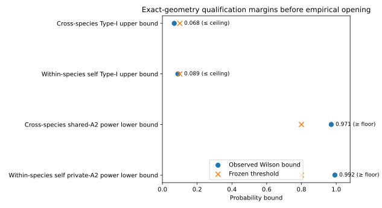
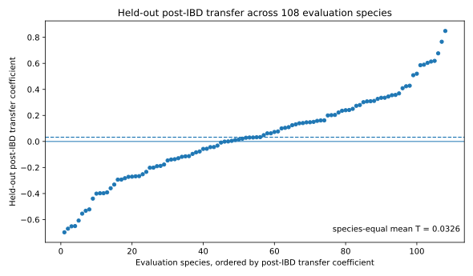

# Is phylogeographic structure a property of place or lineage? A predictive test across 211 mitochondrial datasets

**Empirical manuscript v0.3 — alternative ecological framing; frozen Phase-4 estimand and result unchanged**

Author list: TBD

Target journal: deferred until scope and presentation are finalized. Journal choice cannot change the frozen estimand, qualification thresholds, opening sequence, or interpretation contract.

> Framing note: this version changes the biological question and narrative emphasis, not the analysis. The original v0.2 remains preserved. No species split, response, threshold, model, p-value, or empirical result has been changed.

---

## Abstract

Comparative phylogeography has long used concordant genetic discontinuities among species to infer the repeated effects of landscape barriers and shared biogeographic history. Yet concordance is usually assessed after the focal taxa are visible, leaving a more stringent question unresolved: does the geographic configuration of population differentiation recur strongly enough that information learned from some lineages predicts completely unseen lineages? We define such recurrence prospectively. For each species, exact sampling localities were connected by a density-scaled graph, ordinary isolation by distance (IBD) was removed with an endpoint-safe within-species nuisance fit, and the remaining spatial differentiation was used to learn a geographic field from training species only. A fresh phylogatR COI/COX1 analysis was opened only after the exact empirical geometry passed frozen simulations for false-transfer control, shared-signal detectability and within-species self-detectability. Of 250 response-blind candidate species, 211 survived character-support filtering and inherited a 103-training/108-evaluation split. The exact geometry passed cross-species qualification (maximum private-null Wilson 95% upper bound 0.0681; shared-A2 Wilson 95% lower bound 0.9714). In the single authorized empirical opening, post-IBD geographic recurrence across unseen species was not detected (T = 0.0326, profiled-private p = 0.7393), whereas the separately calibrated within-species self statistic was extreme relative to its frozen null reference (S = -0.2261, upper-tail p = 0.0090; the raw sign is not interpreted against zero). The pre-IBD total-transfer score was 0.0155 and remained descriptive only. Thus, within this broad but opportunistically assembled mitochondrial panel, spatial genetic structure was detectable within species but its geographic configuration was not detectably reusable across unseen lineages at the tested scale. The result supports lineage-conditioned spatial structure rather than one transferable map of phylogeographic differentiation. It does not imply that geographic barriers are unimportant; instead, the effect of place may depend strongly on the lineage encountering it.

---

## Introduction

Comparative phylogeography is built around a geographic idea: if mountains, rivers, coastlines, climatic transition zones, refugia or other features repeatedly restrict movement, independently evolving species may carry corresponding genetic discontinuities in similar places. Concordant phylogeographic breaks have therefore provided evidence that shared landscape history can leave repeated signatures across taxa (Hickerson et al. 2010; Edwards et al. 2022). In this tradition, geography is not merely the backdrop to population history. It is a candidate source of structure that may act repeatedly across lineages.

But the same place need not have the same biological meaning for every species. Barrier permeability depends on dispersal, habitat association, demography, generation time, historical range dynamics and other lineage properties. Comparative phylogeography has increasingly recognized that discordance can itself be biologically informative rather than dismissed as idiosyncratic history, and trait-based approaches explicitly ask why different taxa respond differently to the same broad environmental or biogeographic setting (Papadopoulou & Knowles 2016). Recent predictive work likewise shows that range and organismal traits can help explain whether phylogeographic breaks occur at all (Decker, Provost & Carstens 2025). At a continental scale, Jensen et al. (2024) digitized phylogeographic breaks across 229 North American mammal species and found repeated associations with mountains and major water bodies, but also substantial within-order heterogeneity. That contrast exposes a distinction between retrospective barrier association and prospective geographic recurrence: a feature can align with many observed breaks without establishing that spatial structure learned from some lineages will predict a lineage that was absent from discovery. These developments sharpen a fundamental question that sits underneath the concordance problem: **when population differentiation is spatially structured, how much of that structure belongs to place itself, and how much belongs to the lineage that experienced it?**

A strong place component makes a prospective prediction. Suppose one set of species reveals where genetic differentiation is unusually high. If those locations reflect lineage-general spatial constraints, then the resulting geographic field should contain information about species that were never used to construct it. In contrast, if spatial structure is mainly lineage conditioned, each species may show real within-range differentiation while the geographic configuration of that differentiation fails to recur across lineages. This predictive criterion is stricter than identifying overlapping breaks after all species have been examined. It treats an evaluation species as a genuinely unseen evolutionary system and asks whether geography learned elsewhere is reusable.

Ordinary isolation by distance (IBD) complicates this test. Populations that are farther apart often show greater genetic differentiation even without a place-specific barrier or transition (Wright 1943; Rousset 1997). A geographic field could therefore appear transferable simply because many species share a monotone distance effect. Our primary estimand removes a prospectively fixed, endpoint-safe within-species IBD expectation before asking whether the residual spatial pattern recurs across species. We call this estimand **place beyond IBD**. It should not be read as a direct annotation of physical barriers: excess post-IBD differentiation can arise from physical barriers, ecological transitions, historical fragmentation, refugial structure, secondary contact or spatially heterogeneous demography. Rather, it asks whether any such place-specific component is recurrent enough to be predicted in unseen lineages.

A second problem is inferential rather than biological. A multispecies field can be formally calculated even when the realized sampling geometry cannot control false cross-species transfer under strong private spatial structure, or cannot recover a shared field if one is present. We therefore require the exact empirical geometry to pass prospective synthetic qualification before nucleotide identities are opened. The synthetic worlds preserve endpoint dependence and contrast private lineage-specific structure with a declared shared spatial signal. Failure produces an explicit non-evaluable endpoint rather than a biological conclusion. A separate within-species self qualification asks whether the same evaluation geometry can detect spatial structure within species, allowing a qualified lack of cross-lineage recurrence to be distinguished from a dataset that is simply uninformative.

Here we use this framework to test geographic recurrence across a fresh multispecies mitochondrial panel. Method development used response-blind sampling geometry from public bird and bat data, but those genetic outcomes remained closed. The confirmatory analysis instead used a fresh authenticated phylogatR COI/COX1 archive. Geometry, character admissibility, synthetic qualification and nucleotide identity were opened sequentially under frozen rules. This design yields two competing empirical outcomes. Under a **place-recurrence hypothesis**, post-IBD spatial differentiation learned from training species should predict its geographic configuration in unseen species. Under a **lineage-conditioned hypothesis**, within-species spatial structure can remain detectable while cross-species geographic recurrence is weak. The fresh panel passed the exact-geometry qualification and resolved to the second pattern: spatial structure was detectable within species, but a field learned from 103 training species did not predict post-IBD differentiation across 108 unseen species.

---

## Materials and Methods

### 1. Overview and inferential target

For each species `s`, let sampled localities define nodes in a species-specific spatial graph and let `G_{s,ij}` denote genetic differentiation between connected localities `i` and `j`. The goal is not to pool species into one genetic surface. Instead, each species contributes a within-species turnover pattern, and training species are used to learn a geographic field that is evaluated on species withheld entirely from training.

The primary inferential estimand and secondary descriptive estimand remain separate. The Phase-4 runner produces the primary transfer result, the within-species self diagnostic, and total genetic transfer as a descriptive summary.

**Total genetic transfer** uses within-species rank-standardized genetic differentiation on graph edges. It uses the same graphs, split, species weights, kernel and training-only edge-length-rank control as the primary analysis, but omits biological IBD residualization. Under the frozen Phase-4 rule it is descriptive only unless separately qualified, and cannot override or rescue the primary decision.

**Place beyond IBD**, the primary estimand, first removes an endpoint-safe within-species rank-linear IBD expectation and then rank-standardizes the residual edge turnover. Only this residual estimand can support the claim that geographic location carries transferable information beyond generic distance dependence.

The unit of replication for transfer is the species. Edges contribute to the within-species spatial pattern but are not treated as independent species-level replicates.

### 2. Separation of development and confirmatory data

#### Development geometry

Method development used response-blind sampling geometry derived from the public repository accompanying Decker et al. (2025), frozen at the predeclared source commit. Only species/locus identifiers, accession/header identifiers, coordinates, exact coordinate duplication, record counts, graph geometry, edge lengths, and response-blind support diagnostics were permitted during development.

Pairwise sequence distances, nucleotide-diversity summaries, Monmonier outputs, break presence/absence, and other genetic outcomes were excluded from method selection. Because the upstream Decker data processing was designed for a different phylogeographic analysis, these data are development-only and cannot serve as the confirmatory empirical test.

A response-blind census yielded a frozen one-panel-per-species development set of 221 systems (149 Aves and 72 Chiroptera), divided deterministically into training and evaluation species. The exact development geometry and all failed qualification attempts remain preserved in the repository audit trail.

#### Fresh confirmatory source

The confirmatory source is a genuinely fresh phylogatR download acquired after the full analysis contract was frozen. phylogatR aggregates sequence data from GenBank with georeferenced occurrence information and distributes aligned FASTA files together with occurrence coordinates and provenance information (Pelletier et al. 2022).

The confirmatory taxonomic domain is Animalia excluding Aves, excluding Chiroptera, and excluding the exact frozen 221-species Decker development set. The marker family is COI/COX1 under a frozen alias-normalization rule. If multiple eligible panels exist for one species, the panel is chosen using geometry only: maximum number of exact unique localities, then sequence count, then deterministic lexical tie-breaking. Genetic character identities are unavailable to this choice.

A species requires at least 12 exact unique localities and at least five endpoint-disjoint edges available for the IBD nuisance fit. If more than 250 species are eligible, the first 250 under the frozen source-digest/species hash are retained. If 150–250 are eligible, all are retained. Fewer than 150 species yields `NOT_EVALUABLE_PHASE1_PANEL_TOO_SMALL` and the confirmatory analysis stops before character masks or nucleotide identities are opened.

### 3. Locality definition and density-scaled spatial graphs

The biological spatial node is an exact unique latitude-longitude pair, not an individual sequence. Multiple sequences with identical coordinates are associated with the same locality and therefore do not inflate the number of spatial nodes. Near but nonidentical coordinates are not merged by a post hoc distance threshold.

For a species with `n_s` exact unique localities, the within-species graph uses the frozen density-scaled neighbor rule

`k_s = min(n_s - 1, max(2, floor(0.15 * n_s + 0.5)))`.

This rule was inherited from the qualified core TTF architecture, where fixed small neighbor counts became progressively more local as sampling density increased, whereas a constant neighbor fraction preserved edge-scale observability. The graph rule depends only on locality geometry and cannot respond to genetic outcomes.

Each undirected edge stores its endpoint localities, geographic length, and the number of other graph edges that share neither endpoint. Graph topology is frozen before genetic identity is opened.

### 4. Phased opening of the fresh data

The confirmatory archive is processed under four sequential phases.

#### Phase 1: response-blind geometry

The intake reads provenance files, species/locus identities, accession/header information, and coordinates. For FASTA files, only header structure is used; nucleotide sequence lines are not interpreted for the analysis. The complete archive is hashed, the selected panel is frozen, and the exact graph geometry and deterministic train/evaluation split are written to an immutable receipt.

The required pass state is `FROZEN_RESPONSE_BLIND_PHASE1_GEOMETRY` with at least 150 species. No Phase-2 operation is automatically triggered.

#### Phase 2: character-mask admissibility

Only whether each aligned character is canonical (`A`, `C`, `G`, or `T`) versus noncanonical is revealed. Actual nucleotide identity remains masked. These boolean validity masks are used to determine whether every frozen graph edge has at least one cross-locality sequence pair with sufficient comparable sites.

A sequence pair is valid only when the number of jointly canonical alignment columns is at least 50% of the frozen alignment length. If any frozen edge lacks a valid cross-locality pair, the affected species is marked empirical-outcome `NOT_EVALUABLE`; its graph is not repaired. No marker switching, edge dropping, graph rewiring, or train/evaluation resplitting is permitted. At least 150 species must survive.

#### Phase 3: exact-geometry synthetic qualification

Before nucleotide identities are opened, the exact Phase-2 survivor geometry is subjected to a full dataset-specific synthetic qualification. Synthetic genetic worlds are generated from latent locality states so that pairwise responses sharing a locality are statistically dependent rather than independent edge draws.

The qualification includes private residual structure, shared residual structure, IBD variation, and the inherited profiled-private inference. The frozen design uses eight private-reference configurations with 1,999 worlds per configuration and five mandatory observed cells with 500 worlds per cell. The private-null family must satisfy a Wilson 95% upper rejection bound of at most `0.10`, and the shared moderate-signal A2 cell must satisfy a Wilson 95% lower power bound of at least `0.80`.

Any failure produces `NOT_EVALUABLE`; nucleotide identity remains closed and no empirical genetic transfer statistic is computed.

A separate within-species self-detectability qualification is run on the exact fresh evaluation geometry. It uses endpoint-safe prediction within each species and a frozen null/private-positive synthetic design. This gate is not required to interpret a significant cross-species transfer result. It is required to interpret a later qualified non-significant cross-species result as evidence consistent with lineage-conditioned spatial structure.

#### Phase 4: nucleotide identity and empirical response

Phase 4 is authorized only after complete Phase-3 PASS on the exact Phase-2 survivor geometry. Nucleotide identities are then unmasked under the already frozen response rule. The analysis does not use Phase-4 outcomes to alter species selection, graph topology, IBD rules, bandwidth, null construction, alpha, or qualification thresholds.

### 5. Genetic distance on frozen edges

For every valid cross-locality sequence pair, genetic distance is the uncorrected p-distance over jointly canonical alignment columns. The sequence normalization is uppercase and only `A`, `C`, `G`, and `T` contribute to comparable columns. The locality-pair distance `G_{s,ij}` is the arithmetic mean across all valid sequence pairs connecting locality `i` to locality `j`.

The frozen edge list is retained exactly. If an edge cannot be evaluated under the character-admissibility contract, the response is not rescued by removing or replacing that edge.

### 6. Endpoint-safe isolation-by-distance residualization

IBD is treated as a biological nuisance layer rather than a geometry correction. For target edge `e=(i,j)`, all other edges incident to `i` or `j` are excluded from the nuisance fit. Only endpoint-disjoint within-species edges are allowed to estimate the relation between geographic and genetic separation for that target.

Both geographic and genetic distances are represented by training-set order. An ordinary least-squares regression of genetic rank fraction on geographic rank fraction is fitted using the endpoint-disjoint edges, and the expected and observed order fractions are evaluated for the held-out edge. The fitted slope is not constrained to be nonnegative; this is rank-linear regression, not a shape-constrained monotone regression. The residual is the observed minus expected order fraction. Repeating this procedure for every graph edge yields an out-of-pair residual vector that is subsequently rank-standardized within species.

The procedure is invariant to strictly increasing transformations of geographic or genetic distance and removes a noiseless strictly monotone IBD relationship exactly. These properties do not establish removal of every stochastic or spatially heterogeneous IBD process. The residual estimand and its Type-I guarantee remain conditional on the declared nuisance rule and qualified synthetic family.

### 7. Learning the transferable turnover field

After response construction, training and evaluation species remain strictly disjoint. The spatial field is learned from graph edges of training species only using the inherited exact TTF kernel architecture and frozen 500-km bandwidth. Each training species contributes equally to the field rather than in proportion to its number of edges.

The inherited geometry control removes training-set association with edge-length rank before evaluation. No held-out response is used to tune the field, bandwidth, geometry correction, or private-strength profile.

For each evaluation edge, the trained field produces a predicted turnover value using geographic position alone. Within each evaluation species, predictive skill is summarized as the Spearman correlation between predicted and observed edge turnover. The primary aggregate statistic is

`T = mean_s Spearman(predicted_s, observed_s)`

over every frozen evaluation species. The empirical adapter rejects a non-finite score for any evaluation species rather than silently averaging over the remaining species.

### 8. Profiled-private inference

The null hypothesis is not that traits or genetic responses are exchangeable over localities. Strong spatial structure may exist within every species while remaining private to that lineage. A naive permutation null could therefore destroy the very nuisance structure that must be preserved.

Inference instead uses a profiled-private reference family generated on the frozen empirical geometry. Training-only coherence determines the private-structure profile. For each of eight configurations, the first 999 reference worlds supply the median and median-absolute-deviation scale used to rank compatibility with the observed training coherence. The two most compatible configurations are selected without using the held-out transfer statistic. The remaining 1,000 worlds per configuration supply independent upper-tail Monte Carlo p-values; the primary p-value is the maximum of the two component p-values. The frozen alpha level is `0.05`.

A significant primary result supports transferability beyond private lineage-specific structure under the declared model family. A non-significant result is interpreted only together with qualification and self-detectability evidence.

### 9. Development qualification

The frozen Decker development geometry was used to test the genetic interface before any Decker genetic outcomes were opened. The final cross-species Gate-D qualification was `NOT_EVALUABLE`. The binding private A3 cell had Wilson 95% upper rejection bound `0.10033475332223055`, narrowly exceeding the frozen ceiling `0.10`. The shared-A2 positive-control gate passed, with Wilson 95% lower power bound `0.8355052092686175`, exceeding the frozen floor `0.80`.

A separate within-species self-detectability qualification on the same development geometry passed. Its null Wilson 95% upper bound was `0.053771365501634506`, and its private-A2 Wilson 95% lower power bound was `0.9923756595384479`.

Because the cross-species Type-I gate failed, Decker nucleotide identities, pairwise genetic distances, break labels, and empirical transfer statistics remain unopened and are not used as an empirical result in this study.

### 10. Frozen interpretation rules

A fresh empirical result is interpreted according to the following predeclared branches.

**Transferable place component.** Fresh cross-species qualification passes and the primary place-beyond-IBD empirical test has `p <= 0.05`.

**Lineage-conditioned spatial structure.** Cross-species qualification passes, the primary test has `p > 0.05`, the fresh self-detectability qualification passes, and the empirical within-species self test is significant under its frozen rule.

**Not evaluable for lineage conditioning.** Cross-species qualification passes and the primary test is non-significant, but qualified empirical self-detectability support is absent.

**Design not evaluable.** Any required Phase-1, Phase-2, Phase-3 Type-I, or Phase-3 power gate fails.

No failure branch is reworded as evidence that transferable geography is biologically absent.

### 11. Reproducible reporting

The completed empirical result is linked to its Phase-4 authorization by SHA-256. A downstream reporting tool checks consistency with the frozen qualification, self qualification, rules, geometry fingerprint and species split before generating the Results passage and a complete evaluation-species table. Aggregate means, p-value components, significance flags and the interpretation branch must agree. Input interpretation prose is not copied. This reporting check does not rerun the statistical analysis or independently authenticate upstream source provenance.

The total-transfer descriptor is reported separately from primary inference. Constant response or prediction vectors retain the inherited TTF zero-score convention. Non-finite total scores remain attached to their species and make the complete descriptive aggregate unavailable, rather than changing the evaluation population. Differences between total and residual rank correlations are not fractions of genetic variation explained by IBD.

A closed opening-state or failed Phase-1/2/3 receipt produces a status note only, with no empirical Results paragraph or species scores. This preserves the distinction between completed software, synthetic qualification and empirical evidence.

---

## Results

### Development geometry reveals a distinction between within-lineage detectability and cross-lineage qualification

The endpoint-safe genetic interface was first evaluated on the frozen Decker bird-and-bat sampling geometry without opening its empirical genetic outcomes. The cross-species Gate-D did not meet its prospectively frozen Type-I requirement. The binding private A3 rejection interval had an upper Wilson bound of `0.10033475332223055`, just above the `0.10` ceiling, whereas the shared-A2 power lower bound was `0.8355052092686175` and therefore exceeded the `0.80` power floor. Under the frozen decision rule the development design was consequently `NOT_EVALUABLE` for empirical cross-species transfer.

The separate within-species self-detectability gate passed on the same geometry. Its null upper bound (`0.053771365501634506`) was below the frozen Type-I ceiling and its private-A2 lower power bound (`0.9923756595384479`) was above the frozen power floor. Thus, on this development geometry, the declared synthetic within-species structure is detectable while cross-species calibration fails. This does not establish that the unopened Decker genetic responses contain detectable structure. This distinction motivates qualification on the exact confirmatory geometry rather than assuming that a method validated elsewhere is automatically deployable on a new multispecies dataset.

### Fresh confirmatory sampling geometry and character admissibility

The authenticated phylogatR archive reproduced the frozen source identity exactly (274,988,692 bytes; SHA-256 `5a0fd9ac25893c749d14186fbcce4a46b99163c9d810b36e40eebce7bece61a5`). After the frozen Animalia, taxonomic-exclusion, marker and geometry rules, 14,862 species were eligible before the deterministic cap and 250 species were retained. These 250 species contained a median of 20 exact localities (IQR 15–33; range 12–295) and a median of 39.5 frozen graph edges (IQR 20–105.75). The panel was strongly arthropod dominated (236/250 Arthropoda; 217 Insecta), reflecting the available phylogatR COI/COX1 source domain rather than a balanced taxonomic design.

Phase 2 opened only canonical-character validity masks. Thirty-nine species failed because one or more already-frozen graph edges lacked a valid cross-locality sequence pair under the predeclared comparable-site rule. No failed edge was dropped or rewired. The remaining 211 species retained the inherited Phase-1 split without resplitting: 103 training and 108 evaluation species. Among survivors, the median number of exact localities was 19 (IQR 15–30.5), the median number of frozen edges was 38 (IQR 20–101), and the median minimum endpoint-disjoint nuisance-fit support was 26 edges (IQR 13–82). The survivor panel remained strongly arthropod dominated (200/211 Arthropoda; 183 Insecta).

### Exact-geometry synthetic qualification

The exact 211-species Phase-2 survivor geometry passed the prospectively frozen cross-species Gate-D. Across the four mandatory private-structure cells, rejection rates were 0.046, 0.030, 0.034 and 0.040 at residual amplitudes 0.5, 1, 2 and 3, respectively. The largest Wilson 95% upper bound was 0.06808, below the predeclared 0.10 Type-I ceiling. The shared-A2 positive-control cell rejected in 493/500 worlds (0.986), with Wilson 95% lower bound 0.97139, above the 0.80 power floor. Phase 4 was therefore eligible to open nucleotide identity on this exact geometry.

The separate within-species self-detectability qualification also passed. The null cell rejected in 32/500 worlds (0.064; Wilson upper 0.08895), while the private-A2 cell rejected in 500/500 worlds (Wilson lower 0.99238). This self test is an upper-tail statistic calibrated against its own structural-null distribution; its empirical numerical sign is therefore not interpreted against zero.

*Figure 1. Exact-geometry qualification margins before the empirical opening. Circles show the frozen Wilson bounds and × symbols show the predeclared thresholds. Type-I bounds pass by remaining at or below 0.10; power bounds pass by remaining at or above 0.80. The figure only visualizes already-frozen qualification receipts.*

### Empirical transfer to unseen species

The single authorized Phase-4 opening did not detect cross-species transfer of post-IBD spatial differentiation. The species-equal `place_beyond_ibd` statistic was `T = 0.0325655`; the frozen profiled-private p-value was `0.739261` (`A3 = 0.668332`, `A5 = 0.739261`). Under the predeclared decision rule this is not evidence for a transferable place component.

The independently qualified within-species self diagnostic was significant relative to its frozen null (`S = -0.226098`, upper-tail `p = 0.008991`). Because this statistic is calibrated against a null distribution that is itself shifted below zero by the endpoint-safe self-field construction, significance is interpreted relative to that reference distribution rather than as a positive raw Spearman correlation. Together with the non-significant cross-species test, this resolves the frozen Branch-B decision: `LINEAGE_CONDITIONED_SPATIAL_STRUCTURE_WITHIN_TESTED_DOMAIN`.

The secondary pre-IBD total genetic-transfer score was `0.0155016`. It has no inferential qualification, p-value or significance label and cannot rescue the primary result. A receipt-only exporter independently checked the complete hash-linked result chain and retained all 108 evaluation species in the generated reporting bundle.

*Figure 2. Held-out post-IBD transfer coefficients for all 108 evaluation species, ordered by coefficient only for display. The dashed horizontal line is the frozen species-equal aggregate `T = 0.0325655`, and the zero line is a visual reference. Individual points are descriptive species-level components of the aggregate; no species-level significance tests are performed, and the display ordering has no inferential role.*

---

## Discussion

### From retrospective concordance to predictive geographic recurrence

The central biological question in this study is not simply whether species possess spatial genetic structure. It is whether the **geographic configuration** of that structure contains a component that recurs across evolutionary lineages. Comparative phylogeography has traditionally inferred shared history from concordant patterns among observed taxa. Our criterion is deliberately stronger: if a component of post-IBD differentiation belongs to place rather than only to the lineage in which it was observed, then a field learned without an evaluation species should predict where that unseen species is relatively differentiated.

This changes what counts as evidence for a shared geographic effect. Similar breaks found after examining multiple species remain biologically informative, but they do not by themselves establish out-of-lineage predictability. Here the unit of replication for the recurrence claim is the species. Thousands of within-species graph edges describe spatial structure, but the key test is whether a field estimated from some species generalizes to species excluded entirely from fitting.

### What the result says — and does not say — about geographic barriers

The empirical asymmetry is the main result. The exact 211-species geometry was capable of recovering the declared shared positive field in simulations, and the independent self-detectability procedure found empirical within-species structure to be extreme relative to its frozen null. Yet the post-IBD field learned from 103 species did not predict differentiation across 108 unseen species. Thus the tested data do not support one reusable geographic map of mitochondrial differentiation at the declared spatial scale.

Geographic barriers provide a natural biological interpretation of this result, but they are not identical to the estimand. If a mountain system, river, coastline, climatic transition or historically persistent boundary imposes similar effects on many lineages, it should contribute to a recurrent spatial component. Failure to detect such a component does **not** show that those features are unimportant. The same physical feature can be highly permeable to one lineage and restrictive to another, and different historical range trajectories can cause taxa occupying the same broad region to encounter different effective barriers. The result therefore shifts attention from the question “where are the universal barriers?” toward “for which lineages does a given place become a barrier?”

This distinction also prevents an overinterpretation of the word “place.” Post-IBD excess differentiation may reflect physical barriers, environmental transitions, refugial history, secondary contact, or spatial demographic heterogeneity. A positive recurrence result would establish reusable geography but would still require a mechanistic study to identify which of these processes generated it. Conversely, the present non-detection establishes no universal absence of barriers.

### Place versus lineage

The frozen result is most naturally read as evidence for **lineage-conditioned spatial structure within the tested domain**. This does not mean that spatial structure is random or biologically uninteresting. On the contrary, the within-species diagnostic shows that the evaluation data contain structured spatial information relative to the calibrated reference. What fails is the stronger requirement that its geographic arrangement can be reused across unseen species.

That pattern is compatible with a relational view of barriers. Let the effect of a geographic feature at location x on lineage s be written schematically as

[
B(x,s),
]

rather than as a fixed property B(x) of the map alone. Dispersal ability, habitat dependence, life history, demographic history and historical range movement can all modify B(x,s). Under this view, discordant phylogeographic patterns are not merely noise around an underlying universal barrier map; they may be the expected consequence of interactions between geography and lineage biology. This interpretation aligns with the trait-based shift in comparative phylogeography, which argues that taxon-specific attributes can make discordance predictable rather than incidental (Papadopoulou & Knowles 2016).

The current study does not identify which lineage properties matter. Doing so would require a fresh, prospectively specified test of whether pairs of species with similar dispersal ecology, habitat, present climatic niche or historical range dynamics share more of the same geographic structure. Such a study would be a mechanistic extension of the present result, not a post hoc rescue of the completed field.

### Why isolation by distance must be separated from recurrence

The place-versus-lineage question would be poorly posed if generic distance dependence were allowed to masquerade as a shared geographic effect. Genetic differentiation often increases with distance even in the absence of a spatially localized barrier. The primary estimand therefore asks about recurrence **after** a species-specific endpoint-safe IBD expectation has been removed.

The endpoint-safe construction matters because pairwise observations that share a locality are biologically dependent. For a target locality pair, every other edge incident to either endpoint is excluded from its IBD nuisance fit. The resulting post-IBD quantity is not a perfect decomposition of all demographic processes, but it prevents the simplest form of shared monotone distance dependence from being interpreted as evidence that particular places recur across lineages.

The descriptive pre-IBD total score was small (0.0155) and was never inferentially qualified. We therefore do not infer how much ordinary IBD contributes to the cross-species result, and the difference between total and post-IBD rank correlations is not a variance partition. The supported claim concerns the qualified post-IBD estimand only.

### Qualification strengthens the interpretation of a non-detection

A major difficulty in broad comparative analyses is that failure to find recurrence can arise because recurrence is absent, because spatial support is weak, or because the inference is miscalibrated under lineage-specific structure. The prospective qualification was designed to keep these possibilities separate.

The development bird-and-bat geometry illustrates the problem: within-species self-detectability was strong, but cross-species Type-I control narrowly missed its frozen criterion, so that route was not opened as a biological test. The fresh phylogatR geometry, by contrast, passed both the private-structure error-control gate and the shared-signal power gate before nucleotide identities were opened. The lower confidence bound on recovery of the declared shared-A2 signal was 0.9714. The empirical non-detection therefore occurred in a design that had already demonstrated strong ability to recover the particular shared spatial world used for qualification.

That qualification does not prove power against every imaginable barrier geometry. The synthetic positive field is a declared class of shared spatial structure, not an exhaustive catalogue of rivers, mountain ranges, refugia or historical boundaries. The empirical claim must therefore remain tied to the tested kernel scale, sampling geometry and qualified reference family.

### Scope of the 211-species panel

The 211 species provide unusually broad taxonomic material for a prospective cross-lineage test, but they should not be treated as a probability sample of Animalia. The fresh phylogatR panel is opportunistically assembled from available COI/COX1 data after frozen geometry and character-support filters; insects and other arthropods are prominent and other animal groups are represented more sparsely. The appropriate scope is therefore a broad multispecies mitochondrial panel, not “animals in general.”

Mitochondrial sequence variation supplies wide taxonomic coverage but follows one genealogical history and can differ from nuclear genomic structure. Likewise, the density-scaled graphs, 500-km field, geographic support of the included taxa and public-database sampling process define the spatial scale at which recurrence is tested. A lineage-conditioned result here does not imply that finer-scale barriers, regional codistributed assemblages, particular clades or nuclear genomic datasets would show the same outcome.

Training and evaluation species also need not be phylogenetically independent. Species-disjoint prediction prevents an evaluation species' own response from influencing the learned field, but it does not isolate causal geography from shared ancestry or common demographic history. A positive result would therefore establish reusable spatial information, not a unique geographic mechanism. The present non-detection likewise does not identify which lineage histories prevented recurrence.

### Implications for comparative phylogeography

The result suggests a useful change in emphasis. The classical question asks whether multiple taxa show concordant breaks. A predictive comparative phylogeography can ask an additional question: **does the apparent shared geography contain enough reusable information to forecast an unseen lineage?** These are not equivalent standards.

This distinction makes discordance more informative. Jensen et al. (2024), for example, found that broad geographic barriers could be important across North American mammals while responses still varied substantially among species within orders. Our predictive criterion asks a complementary question: whether the spatial information apparent in observed taxa is reusable for a taxon excluded from fitting. If a barrier or historical event is important only for particular ecological or demographic classes of species, an all-species field may average toward weak recurrence even though strong conditional recurrence exists within biologically coherent subsets. The next question is therefore not to search the completed 211-species result for a favorable subgroup. It is to define, before new outcomes are opened, which biological relations should make two lineages respond similarly to the same geography and then test those predictions on an independent panel.

### Conclusion

Within the fresh phylogatR COI/COX1 domain, spatial genetic structure was detectable within species but its post-IBD geographic configuration was not detectably reusable across unseen lineages. The result therefore supports a lineage-conditioned view of phylogeographic structure at the tested scale rather than one transferable map of differentiation. Geographic barriers and shared historical events may still be important, but their effects need not be fixed properties of place alone. A productive next step is to ask which biological properties determine when the same place becomes the same barrier for different lineages.

---

## Data and code availability

All method code, prospective protocols, failed qualification attempts, terminal receipts, and opening-state ledgers are versioned in the TTF repository. Failed designs are preserved rather than overwritten. The exact empirical Phase-4 handoff is frozen in `benchmarks/frozen/genetic_phylogatr_phase4_empirical_handoff_v0.1.json`. The validated receipt-only reporting bundle is versioned under `manuscript/generated/genetic_ttf_phase4_v0.1/`; its `species_scores.csv` is Table S6 and contains all 108 frozen evaluation species, while `export_manifest.json` records the source and output SHA-256 values. Sequence identities and edge-level genetic-distance vectors are not serialized in the reporting artifacts. The source archive is handled according to its provenance and redistribution conditions.

---

## References

Decker, S. K., Provost, K. L., & Carstens, B. C. (2025). Bats of a feather: Range characteristics and wing morphology predict phylogeographic breaks in volant vertebrates. *Frontiers of Biogeography*, 18, e139911. https://doi.org/10.21425/fob.18.139911

Edwards, S. V., Robin, V. V., Ferrand, N., & Moritz, C. (2022). The evolution of comparative phylogeography: Putting the geography (and more) into comparative population genomics. *Genome Biology and Evolution*, 14(1), evab176. https://doi.org/10.1093/gbe/evab176

Hickerson, M. J., Carstens, B. C., Cavender-Bares, J., Crandall, K. A., Graham, C. H., Johnson, J. B., Rissler, L., Victoriano, P. F., & Yoder, A. D. (2010). Phylogeography's past, present, and future: 10 years after Avise, 2000. *Molecular Phylogenetics and Evolution*, 54(1), 291–301. https://doi.org/10.1016/j.ympev.2009.09.016

Jensen, A. J., Cove, M. V., Goldstein, B. R., Kays, R., McShea, W., Pacifici, K., Rooney, B., & Kierepka, E. (2024). Geographic barriers but not life history traits shape the phylogeography of North American mammals. *Global Ecology and Biogeography*, 33, e13875. https://doi.org/10.1111/geb.13875

Papadopoulou, A., & Knowles, L. L. (2016). Toward a paradigm shift in comparative phylogeography driven by trait-based hypotheses. *Proceedings of the National Academy of Sciences of the United States of America*, 113(29), 8018–8024. https://doi.org/10.1073/pnas.1601069113

Pelletier, T. A., Parsons, D. J., Decker, S. K., Crouch, S., Franz, E., Ohrstrom, J., & Carstens, B. C. (2022). phylogatR: Phylogeographic data aggregation and repurposing. *Molecular Ecology Resources*, 22, 2830–2842. https://doi.org/10.1111/1755-0998.13673

Rousset, F. (1997). Genetic differentiation and estimation of gene flow from F-statistics under isolation by distance. *Genetics*, 145, 1219–1228. https://doi.org/10.1093/genetics/145.4.1219

Wright, S. (1943). Isolation by distance. *Genetics*, 28, 114–138. https://doi.org/10.1093/genetics/28.2.114
